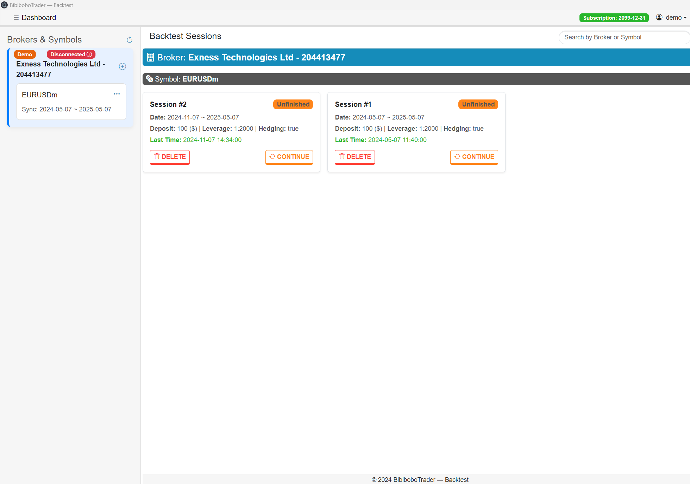

# 🔁 BibiBobo-Backtest Backtest Simulator

An advanced backtesting tool for **Personal Traders**, combining manual bar replay, strategy testing, and **AI-assisted trade decisions** — all rendered beautifully using **TradingView charts**.
- 🧰 Built with Electron + Node.js + Supabase + TradingView

---

## ✨ Features

###Current:

- 🔄 **MT5 Sync** — Communicate with MetaTrader 5 to pull historical data and interact with testing session
- 🗂️ Local-based OHLC data
- 📈 **Manual Bar Replay** — Simulate the market like real trading

###Next:

- 🧠 **AI-Assisted Decisions** — Ask AI about patterns or entry logic
- 🧪 **Strategy Testing Mode** — Auto-execute and measure rules
- 📊 **Custom RAG (Retrieval-Augmented Generation)** — Enrich AI with your trading logic

---

## 🧠 About the AI Features

The AI features are powered by OpenAI (or any LLM) via structured prompts. With optional RAG support, you can plug in your own strategy memory base and retrieve insights dynamically during replay.

---

## 📌 License

Personal use only. TradingView charting library is **not redistributable**. Please obtain a commercial license if required.

---

## ⭐ Stay Updated

- Telegram: https://t.me/kktradingtool
- or DM: https://t.me/kienxuandaoit
